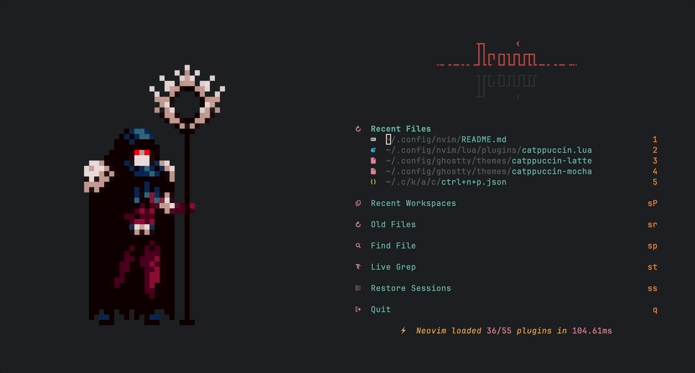

## Introduction

Personal use [Neovim](https://neovim.io) config files.

## Installation

### Prerequisites

- Base on [**Neovim**](https://neovim.io). Install it by your own preferred.
- Idea from [NvChad](https://nvchad.com).

### Optional

- The best font for me is [**JetBrains Mono**](https://www.jetbrains.com/lp/mono/), use modified third-part version [JetBrainsMono Nerd Font Mono](https://www.nerdfonts.com/font-downloads).
- If you need a terminal emulator, [ghostty](https://ghostty.org/) is recommended.
- If you need a GUI lake GVim or Mvim, try [Neovide](https://neovide.dev).

### Install

Inside Neovim, use the cmd command to install.

- Install all plugins use [lazy.nvim](https://github.com/folke/lazy.nvim):

```vim
:Lazy sync
```

- Install all Lsp, Formatter, Linter and debug adapter:

```vim
:MasonInstallAll
```

- To update plugins:

```vim
:Lazy sync
```

### Additional install

- Image support is provided by [snacks.image](https://github.com/folke/snacks.nvim/blob/main/docs/image.md) and requires an additional installation of [ImageMagick](https://imagemagick.org/).
- Dashboard supported by [snacks.dashboard](https://github.com/folke/snacks.nvim/blob/main/docs/dashboard.md) and requires an additional installation of [chafa](https://github.com/hpjansson/chafa) support for `.gif` file display in the terminal environment.
- Others
  - fzf
  - ripgrep
  - fd

## Special thanks

- Special thanks the dashboard gif from 👍[OcO](https://oco.itch.io/), his:
  - [medieval-fantasy-character-pack-6](https://oco.itch.io/medieval-fantasy-character-pack-6) pixel-art is so fantasy!!!
  - [medieval-fantasy-character-pack-7](https://oco.itch.io/medieval-fantasy-character-pack-7) pixel-art is so fantasy!!!
