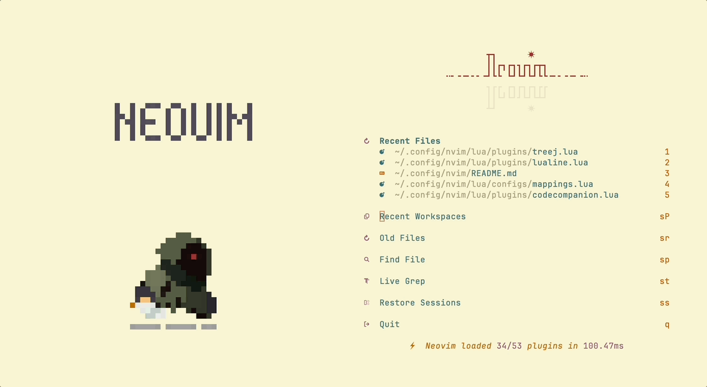
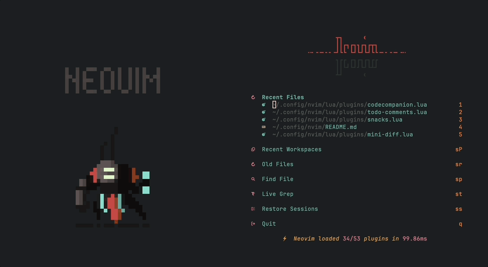

## Installation

### Prerequisites

- Base on [**Neovim**](https://neovim.io). Install it by your own preferred.
- Idea from [NvChad](https://nvchad.com).

### Optional

- The best font is [**JetBrains Mono**](https://www.jetbrains.com/lp/mono/), use modified third-part version [JetBrainsMono Nerd Font Mono](https://www.nerdfonts.com/font-downloads).
- If you need a terminal emulator, recommend [ghostty](https://ghostty.org/) .

### Install

Inside Neovim, use these command to install.

- Install all plugins use [lazy.nvim](https://github.com/folke/lazy.nvim):

```vim
:Lazy sync
```

- Install all LSP, Formatter, Linter and debug adapter use [mason.nvim](https://github.com/mason-org/mason.nvim):

```vim
:MasonInstallEnsured
```

- Install all Tree-sitter parsers use [nvim-treesitter](https://github.com/nvim-treesitter/nvim-treesitter/tree/main):

```vim
:TSInstallEnsured
```

### Additional install

- Image support provided by [snacks.image](https://github.com/folke/snacks.nvim/blob/main/docs/image.md) and requires an additional installation of [ImageMagick](https://imagemagick.org/).
- Dashboard supported by [snacks.dashboard](https://github.com/folke/snacks.nvim/blob/main/docs/dashboard.md) and requires an additional installation of [chafa](https://github.com/hpjansson/chafa) support for `.gif` file display in the terminal environment.
- Others
  - HomeBrew
    - fzf
    - ripgrep
    - fd
    - ghostscript
    - tectonic
  - npm
    - @mermaid-js/mermaid-cli
    - @google/gemini-cli
