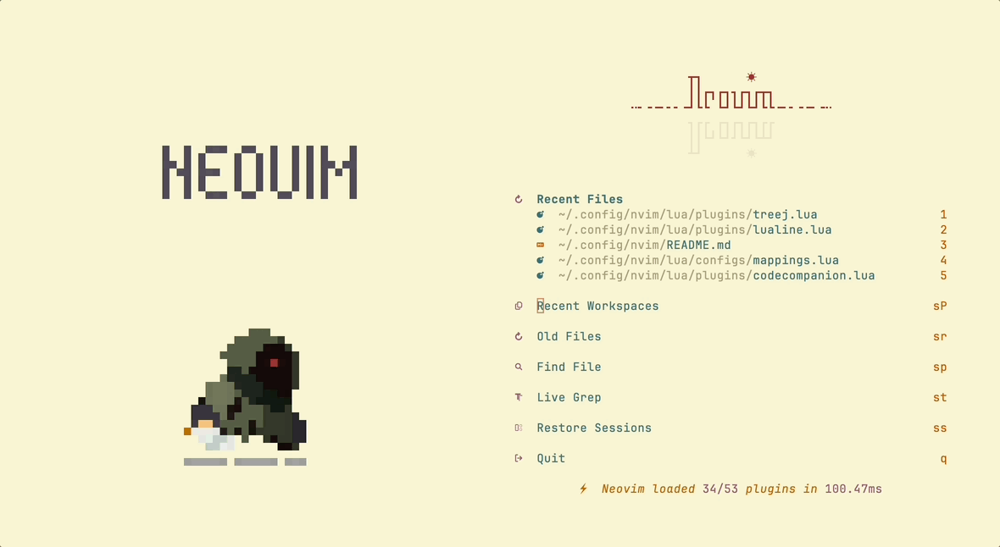
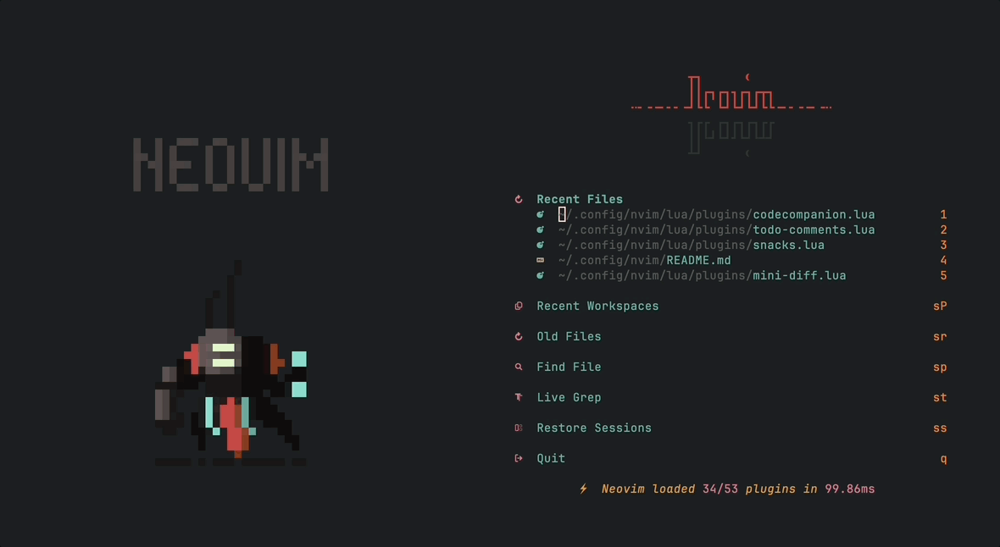

<div align="center">

# My Neovim Configuration

A personal Neovim configuration focused on minimalism, fluidity, and aesthetics.

[](https://neovim.io)
[](https://www.lua.org)

</div>

### Showcase

|                      Light Mode                       |                      Dark Mode                       |
| :---------------------------------------------------: | :--------------------------------------------------: |
|  |  |

## Installation

### Prerequisites

- [**Neovim**](https://neovim.io) is required. Please install it using your preferred package manager.
- This configuration is inspired by [NvChad](https://nvchad.com).

### Recommendations (Optional)

- **Font:** [JetBrainsMono Nerd Font](https://www.nerdfonts.com/font-downloads) is highly recommended.
- **Terminal:** [Ghostty](https://ghostty.org/) is the recommended terminal emulator.

### Setup

Run the following commands within Neovim to complete the installation:

- Install plugins via [lazy.nvim](https://github.com/folke/lazy.nvim):

```vim
:Lazy sync
```

- Install LSPs, Formatters, Linters, and Debug Adapters via [mason.nvim](https://github.com/mason-org/mason.nvim):

```vim
:MasonInstallEnsured
```

- Install Tree-sitter parsers via [nvim-treesitter](https://github.com/nvim-treesitter/nvim-treesitter):

```vim
:TSInstallEnsured
```

### Additional Dependencies

- **Image Support:** Provided by [snacks.image](https://github.com/folke/snacks.nvim/blob/main/docs/image.md). Requires [ImageMagick](https://imagemagick.org/).
- **Dashboard:** Powered by [snacks.dashboard](https://github.com/folke/snacks.nvim/blob/main/docs/dashboard.md). Requires [chafa](https://github.com/hpjansson/chafa) for displaying `.gif` files in the terminal.
- **System Tools:**
  - **Homebrew:** `fzf`, `ripgrep`, `fd`, `ghostscript`, `tectonic`
  - **npm:** `@mermaid-js/mermaid-cli`, `@google/gemini-cli`
